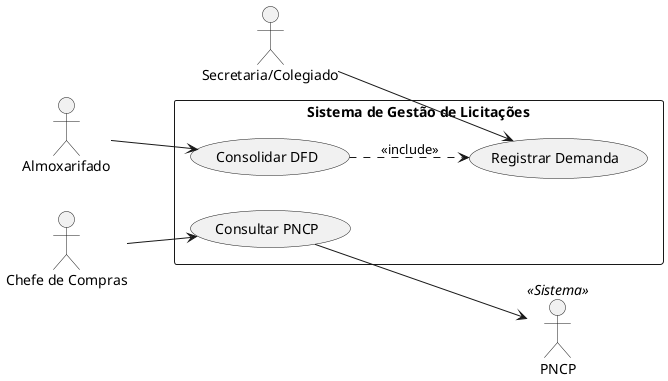

# Grupo 01 — Consolidação de Demandas (DFD)

## Módulo do Sistema

Coleta e consolidação de demandas das secretarias em um Documento de Formalização da Demanda (DFD) único.

## Responsabilidade

- Receber demandas textuais/formulários das secretarias
- Validar e consolidar itens (eliminar duplicatas, normalizar especificações)
- Gerar DFD com lista consolidada de itens solicitados

**Entradas:** Formulários/demandas das secretarias (tipo, quantidade, justificativa, secretaria)  
**Saídas:** DFD com lista consolidada de itens

---

## Entregas Mínimas

| Artefato | Descrição |
|----------|-----------|
| Casos de uso (mínimo 4) | Cadastrar demanda, consolidar, validar, gerar DFD |
| Diagrama UML de classes | `Demanda`, `Secretaria`, `Item`, `DFD` |
| Diagrama de sequência | Fluxo: coleta → consolidação → geração de DFD |
| BPMN | Processo com swimlanes por secretaria, prazos de coleta |
| Backlog | Mínimo 5 histórias de usuário |
| ADRs (mínimo 2) | Ex.: formato de armazenamento, detecção de duplicatas |
| Testes | Unitários e de integração (validação de consolidação) |
| Auditoria | Log de quem criou/modificou cada demanda |

---

## Interfaces com Outros Módulos

- **Saída → G02 (ETP):** DFD consolidado

---

## Entrega do Grupo

> Preencha esta seção ao finalizar:

- **Integrantes:**
- **Data de entrega:**
- **Branch/PR:**


---

## 📋 O que entregar

### Artefato 1: `atores.md`
Documento descrevendo cada ator do sistema com:
- **Nome** do ator
- **Tipo** (primário / secundário / sistema externo)
- **Descrição** do papel no processo
- **Casos de uso** com os quais interage

### Artefato 2: `diagrama-casos-de-uso.png` + fonte (`.puml` ou `.drawio`)
Diagrama UML de Casos de Uso contendo:
- Todos os atores identificados
- Todos os casos de uso do sistema (mínimo 15)
- Relacionamentos: `<<include>>`, `<<extend>>` onde aplicável
- Fronteira do sistema claramente delimitada (boundary)

### Artefato 3: `README.md` (este arquivo — preencha a seção de entrega)

---

## 🔍 Casos de Uso Sugeridos (mínimo a cobrir)

Com base no contexto do sistema, identifique e modele (mas não se limite a):

- Registrar Demanda de Material/Serviço
- Consolidar Demandas (DFD)
- Elaborar Plano de Contratação Anual (PCA)
- Realizar Cotação de Preços
- Elaborar Estudo Técnico Preliminar (ETP)
- Elaborar Mapa de Riscos
- Elaborar Termo de Referência (TR)
- Enviar Processo à Prefeitura
- Gerenciar Atas de Registro de Preços
- Emitir Ordem de Fornecimento
- Consultar PNCP
- Consultar Banco de Preços
- Notificar Prazo de Entrega
- Validar Documentação Jurídica

---

## 🛠️ Ferramentas Recomendadas

| Ferramenta | Tipo | Link | Observação |
|-----------|------|------|------------|
| **PlantUML** | Texto → Diagrama | [plantuml.com](https://plantuml.com) | Preferencial — gera fonte versionável |
| **draw.io** | Visual, gratuito | [app.diagrams.net](https://app.diagrams.net) | Exporta `.drawio` (XML) — boa alternativa |
| **Lucidchart** | Visual online | [lucidchart.com](https://lucidchart.com) | Versão gratuita limitada |

> 💡 **Dica PlantUML**: Use o [editor online](https://www.plantuml.com/plantuml/uml/) para testar sem instalação. Salve o código `.puml` no repositório — é texto puro, versionável e auditável.

### Exemplo de estrutura PlantUML para UCs:



---

## 📁 Estrutura esperada da pasta

```
grupo-01-casos-de-uso/
├── README.md                        ← este arquivo (preencha a seção abaixo)
├── atores.md                        ← descrição dos atores
├── diagrama-casos-de-uso.puml       ← fonte PlantUML (ou .drawio)
└── diagrama-casos-de-uso.png        ← exportação em imagem
```

---

## ✏️ Seção de Entrega (preencher pelo grupo)

**Integrantes:**
- Lucas Freitas Menezes | 26280
- Jose Diego de Sá Pires | 26391
- João Vitor Moreira Santos | 26360
- Natan Malta | 
- Arthur Gonçalves Malheiro Ferreira | 25983

**Decisões tomadas:**
>A primeira decisão relevante foi a criação de um Módulo de Auditoria Integrado (Audit Trail) (ADR-002). O sistema gravará logs em uma tabela append-only cobrindo desde a criação do rascunho da demanda até o bloqueio de prazos e a geração do DFD. A rastreabilidade captura não apenas as ações, mas o estado exato dos dados (campos JSON de dados_anteriores e dados_novos).

>A segunda decisão tratou da Detecção de Duplicatas (ADR-001). Optamos por não automatizar a consolidação em 100% para evitar falhas em licitações críticas. O sistema usa um algoritmo de similaridade textual para sugerir a fusão de itens semelhantes, mas exige a homologação manual do Analista de Compras.

>Na modelagem de Casos de Uso, focamos em isolar a responsabilidade do módulo DFD. Extraímos a "Validação de Demanda" como um <<include>> obrigatório e tratamos sistemas externos (PNCP e Banco de Preços) como atores bem definidos.

No BPMN, incluímos uma swimlane (raia) dedicada exclusivamente às ações invisíveis do sistema (Auditoria), garantindo que as regras de negócio de rastreabilidade estivessem mapeadas visualmente no fluxo operacional.
**Limitações identificadas:**
>A principal limitação foi definir como o sistema lidará com o fluxo de aprovação caso uma secretaria conteste um corte de quantidade feito pelo Setor de Compras na consolidação. Além disso, a interface exata de comunicação de dados com o Módulo G02 (ETP) foi mapeada conceitualmente, mas o formato técnico dos dados trafegados (JSON, XML) ainda precisará de definição futura.


**Rastreabilidade:**
 >Baseado no contexto do sistema
 >Baseado nos requisitos de controle governamental (Auditoria rigorosa do fluxo).
 >Baseado na integração com outros grupos: Recebe demandas das Secretarias como entrada; entrega o DFD consolidado ao G02 (ETP) como saída.
