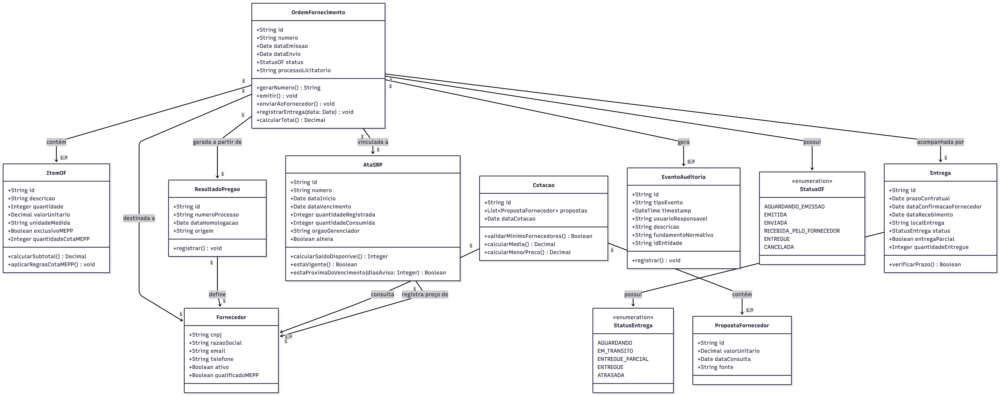

# Diagrama UML de Classes — Grupo 08
## Módulo: Controle de Ordem de Fornecimento (OF)

**Integrantes:** Vitor Barros, Filipe Silva, Michel Batista, João Pedro Carvalho, Kelvin Keite  
**Disciplina:** Engenharia de Software I — 2026.1  
**Professor:** Mateus Silva

---

## Diagrama

---

## Descrição das Classes

| Classe | Responsabilidade |
|--------|-----------------|
| `OrdemFornecimento` | Entidade central do módulo. Representa o pedido formal ao fornecedor após o pregão. |
| `ItemOF` | Cada item incluído na OF, com regras de cota ME/EPP aplicadas automaticamente. |
| `Fornecedor` | Empresa vencedora do pregão que receberá e executará a OF. |
| `AtaSRP` | Ata de Registro de Preços vinculada à OF. Controla saldo disponível e validade. |
| `Entrega` | Rastreia prazo, confirmação de recebimento e data de entrega física. |
| `ResultadoPregao` | Dados recebidos do módulo G07 que originam a OF. |
| `Cotacao` | Registra as propostas dos fornecedores e valida o mínimo de 3 (RN-10). |
| `PropostaFornecedor` | Proposta individual de um fornecedor na fase de cotação. |
| `EventoAuditoria` | Registro imutável enviado ao G09 para trilha de auditoria. |

---

## Regras de Negócio Mapeadas no Modelo

| Regra | Onde implementada |
|-------|------------------|
| RN-01 — Exclusivo ME/EPP (≤ R$ 80k) | `ItemOF.aplicarRegrasCotaMEPP()` |
| RN-02 — Cota 25% ME/EPP (> R$ 80k) | `ItemOF.aplicarRegrasCotaMEPP()` |
| RN-03 — Anti-fracionamento | `OrdemFornecimento.emitir()` |
| RN-04 — Saldo e validade da ata | `AtaSRP.calcularSaldoDisponivel()`, `AtaSRP.estaVigente()` |
| RN-08 — Limite 50% adesão carona | `AtaSRP.calcularSaldoDisponivel()` quando `alheia = true` |
| RN-10 — Mínimo 3 fornecedores | `Cotacao.validarMinimoFornecedores()` |
