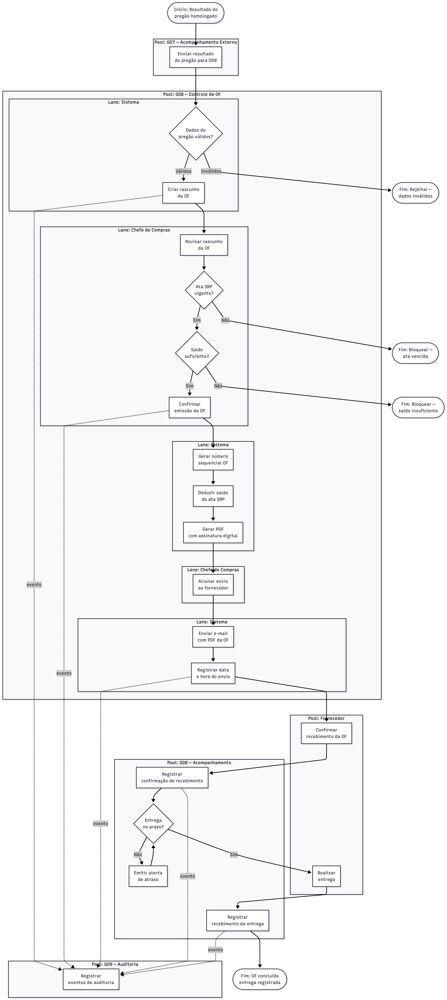

# BPMN — Grupo 08
## Módulo: Controle de Ordem de Fornecimento (OF)

**Integrantes:** Vitor Barros Batista (26341), Filipe Silva Cavalcanti (26211), Michel Batista (26075), João Pedro Ribeiro (26640), Kelvin Keite  
**Disciplina:** Engenharia de Software I — 2026.1  
**Professor:** Mateus Silva

---

## Diagrama

---

## Descrição do Processo

O diagrama representa o ciclo completo de uma Ordem de Fornecimento, organizado em pools e lanes por ator:

- **G07 (Acompanhamento Externo):** envia o resultado do pregão homologado para o módulo G08.
- **G08 / Lane Sistema:** valida os dados recebidos e cria o rascunho da OF. Também gera o número sequencial, deduz o saldo da ata SRP e gera o PDF com assinatura digital.
- **G08 / Lane Chefe de Compras:** revisa o rascunho, confirma a emissão e aciona o envio ao fornecedor.
- **Fornecedor:** confirma o recebimento da OF e realiza a entrega.
- **G08 / Lane Acompanhamento:** registra a confirmação de recebimento, monitora o prazo de entrega e registra a entrega física.
- **G09 (Auditoria):** recebe eventos de auditoria em cada etapa relevante do processo.

### Caminhos de Exceção

| Exceção | Ponto de ocorrência | Resultado |
|---------|-------------------|-----------|
| Dados do pregão inválidos | Após recebimento de G07 | Rejeição com notificação ao G07 |
| Ata SRP vencida | Na confirmação da emissão | Bloqueio com data de vencimento exibida |
| Saldo insuficiente | Na confirmação da emissão | Bloqueio com saldo disponível exibido |
| Prazo de entrega vencido | No acompanhamento | Alerta automático ao Chefe de Compras |
