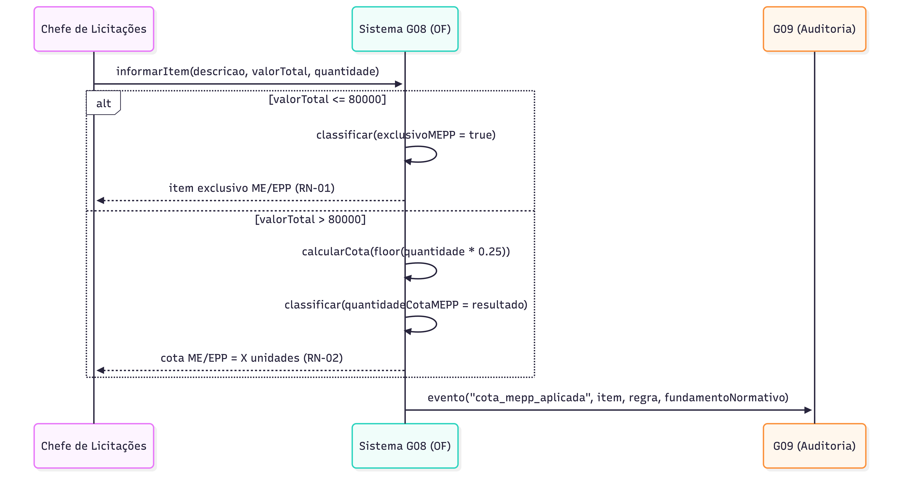
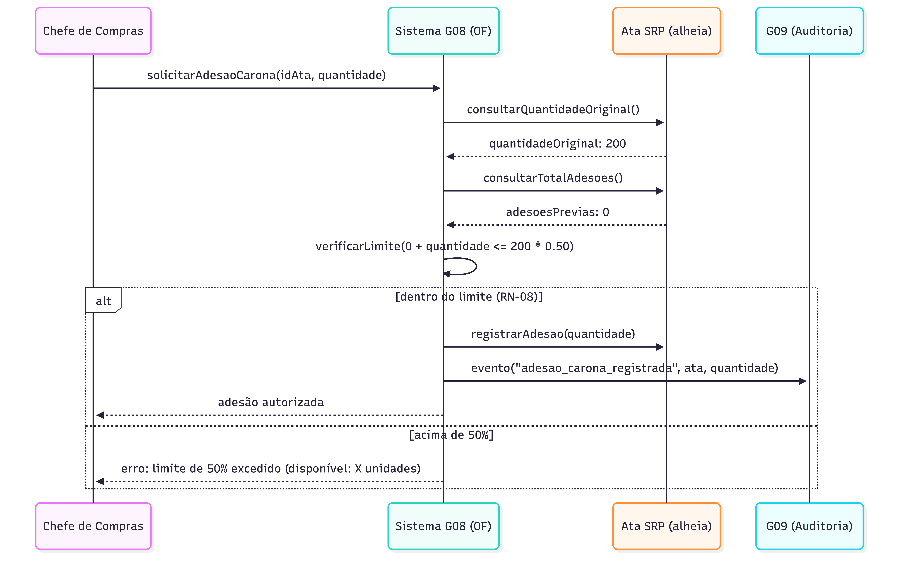
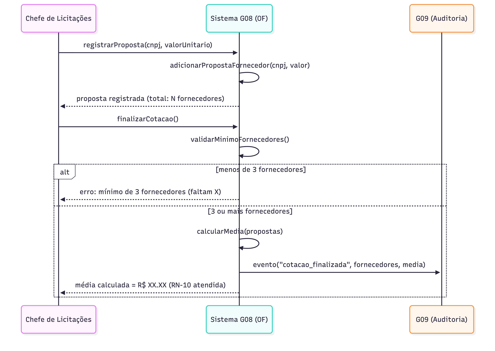

# Diagramas de Sequência — Grupo 08
## Módulo: Controle de Ordem de Fornecimento (OF)

**Integrantes:** Vitor Barros Batista (26341), Filipe Silva Cavalcanti (26211), Michel Batista (26075), João Pedro Ribeiro (26640), Kelvin Keite  
**Disciplina:** Engenharia de Software I — 2026.1  
**Professor:** Mateus Silva

---

## DS-01 — Fluxo Principal: Receber Resultado → Gerar OF → Enviar → Acompanhar

Representa o fluxo completo do módulo G08. G07 envia o resultado do pregão; o sistema valida os dados e cria um rascunho. O Chefe de Compras confirma a emissão após verificação de saldo e validade da ata SRP. A OF é gerada com número sequencial, enviada ao fornecedor em PDF, e a entrega é acompanhada até o registro final. Todos os eventos são enviados ao G09 para auditoria.

---

## DS-02 — Validação de Cota ME/EPP

O Chefe de Licitações informa o item com valor total e quantidade. O sistema aplica automaticamente RN-01 (exclusivo ME/EPP para valores ≤ R$ 80.000) ou RN-02 (cota de 25% arredondada para baixo para valores > R$ 80.000), e registra o fundamento normativo para G09.

---

## DS-03 — Adesão a Ata de Outro Órgão (Carona)

O Chefe de Compras solicita adesão a uma ata alheia. O sistema consulta o quantitativo original e o total de adesões já realizadas, verificando se a nova adesão não ultrapassa 50% do quantitativo original (RN-08). Dentro do limite, a adesão é registrada; acima, é bloqueada com o limite disponível informado.

---

## DS-04 — Validação de Cotação com Mínimo de 3 Fornecedores

O Chefe de Licitações registra propostas de fornecedores. O sistema valida CNPJs distintos e bloqueia a finalização com menos de 3 fornecedores (RN-10). Com 3 ou mais, calcula e sugere a média aritmética como valor de referência, enviando evento de auditoria ao G09.
